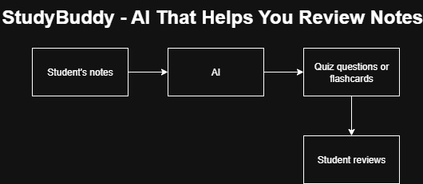

# StudyBuddy – AI That Helps You Review Notes

Final project for the Building AI course

## Summary

StudyBuddy is an AI tool that helps students study smarter. It reads your class notes and automatically creates short quiz questions or flashcards to help you review. Building AI course project.

## Background

When studying for exams, it’s hard to know what to focus on. Reading the same notes over and over can get boring, and sometimes we don’t realize which topics are the most important. I wanted to make something that makes studying easier and more fun.

Problems this idea tries to solve:

* Students don’t know how to turn notes into study questions.
* Studying from plain text is boring and not interactive.
* People waste time figuring out what’s important instead of actually learning.

My motivation is that I often take a lot of notes but don’t use them effectively. If an AI could turn my notes into quick quizzes, I’d probably study more often and remember things better.

## How is it used?

* The student uploads or copies their notes into the app.
* AI scans the text, finds key terms and definitions.
* It automatically creates simple quiz questions or flashcards like:
  * “What is photosynthesis?”
  * “Define Newton’s Second Law.”
* The student can then test themselves before a test or exam.

It could be used by middle school, high school, or college students (basically anyone who studies using notes).

## Data sources and AI methods

Data sources:

* The user’s own notes (entered as text).
* Optionally, open educational text datasets for improving the AI.

AI methods:

* Natural Language Processing (NLP) for finding key terms and sentences.
* Simple keyword extraction or question generation.
* Could later use machine learning to rank which topics appear most often.

Example of how a simple version could work in Python:
```
def make_quiz(notes):
    lines = notes.split(".")
    for line in lines:
        if "is" in line:
            parts = line.split(" is ")
            print("Question: What is " + parts[0].strip() + "?")
            print("Answer:", parts[1].strip())

make_quiz("Photosynthesis is the process by which plants make food. Gravity is a force that pulls objects down.")
```
## Challenges

* The AI might not always make perfect questions (some could be too easy or confusing).
* Different subjects use different formats (math vs. history vs. biology).
* Privacy: if notes are uploaded online, they need to be stored safely.

## What next?

In the future, StudyBuddy could:

* Work with Google Docs or Notion to pull notes automatically.
* Let students share quizzes with classmates.
* Include voice or flashcard games for more interactive studying.

To keep improving it, I’d need help from people who know more about natural language processing and user interface design.

## Acknowledgments

* Inspired by my own struggles while studying for tests.
* Idea influenced by AI-based note-taking tools and flashcard apps like Quizlet.
* Coding concept inspired by Python NLP tutorials.

## Flowchart


